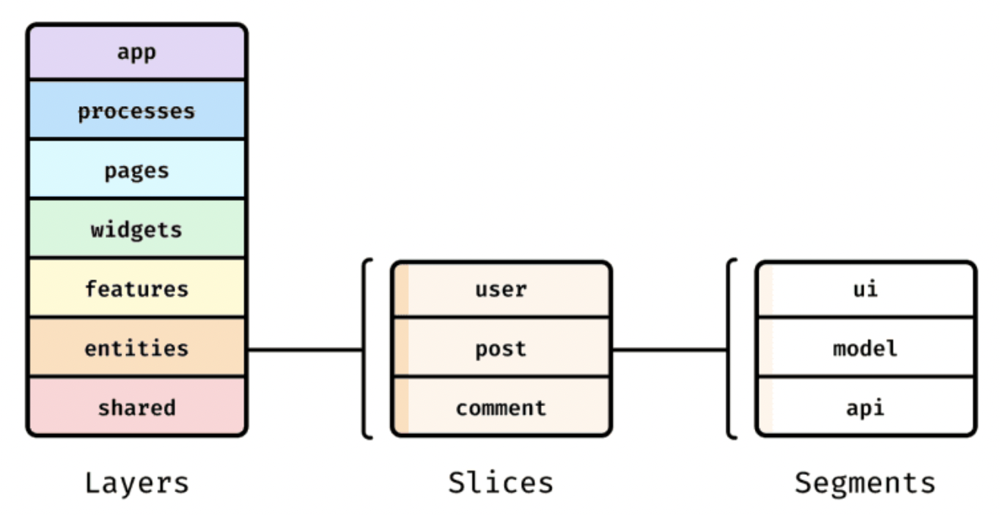

# 기능 분할 설계 - 최고의 프론트엔드 아키텍처

https://emewjin.github.io/feature-sliced-design/
https://feature-sliced.design/
https://github.com/ani-team/github-client
https://github.com/noveogroup-amorgunov/nukeapp

## 들어가며

프론트엔드 개발자는 종종 애플리케이션 아키텍처와 관련된 문제에 직면한다. 대부분 모듈 간의 느슨한 결합과 높은 응집력을 제공해야 하며 쉽게 확장할 수 있는 아키텍처를 필요함

이 글은 기능 분할 설계(Feature-Sliced Design, FSD) 아키텍처에 대해 설명



### 레이어

최상위 디렉터리이자 애플리케이션 분해의 첫 번째 단계

레이어의 수는 최대 7개로 제한되어 있으며, 일부 선택 사항이지만 표준화되어 있음

```bash
└─ src/
    ├─ app/
    ├─ processes/ (deprecated)
    ├─ pages/
    ├─ widgets/
    ├─ features/
    ├─ entities/
    └─ shared/
```

각 레이어에는 고유한 책임 영역이 있으며, 이는 비즈니스 지향적이다.

각 레이어는?

- app:
  - 애플리케이션 로직이 초기화되는 곳
  - 라우터, 전역 스타일, 전역 타입 선언 등이 정의
  - 애플리케이션의 진입점 역할
- processes:
  - 여러 단계로 이루어진 등록과 같이 여러 페이지에 걸쳐 있는 프로세스 처리
  - 해당 레이어는 더 이상 사용되지 않는 것으로 간주됨
  - 선택적 레이어
- pages:
  - 애플리케이션의 페이지가 포함됨
- widgets:
  - 페이지에 사용되는 독립적인 UI 컴포넌트
- features:
  - 비즈니스 가치를 전달하는 사용자 시나리오와 기능을 다룸
  - 예를 들어 좋아요, 리뷰 작성, 제품 평가 등이 있음
  - 선택적 레이어
- entities:
  - 비즈니스 엔티티를 나타냄
  - 이러한 엔티티에는 사용자, 리뷰, 댓글 등이 포함될 수 있음
  - 선택적 레이어
- shared:
  - 특정 비즈니스 로직에 종속되지 않은 재사용 가능한 컴포넌트와 유틸리티가 포함되어 있음
  - UI 키드, axios 설정, 애플리케이션 설정, 비즈니스 로직에 묶이지 않은 핼퍼 등

기능 분할 설계의 주요 특징 중 하나는 계층 구조

- 한 방향으로만 향하는 선형적인 흐름을 유지하기 위함
  - 레이어 구조에서 features 레이어가 entities 레이어 보다 더 위에 있기 때문에 entities 레이어는 features 레이어의 기능을 사용할 수 없다
- 계층 구조에서 레이어의 위치가 낮을수록 코드가 더 많은 곳에서 사용될 가능성이 높기 때문에, 레이어를 변경하는 것은 위험

### 슬라이스

각 레이어에는 애플리케이션 분해의 두 번째 수준인 슬라이스라는 하위 디렉터리가 있음

- 슬라이스에서 연결은 추상적인 것이 아니라 특정 비즈니스 엔티티에 대한 것
- 슬라이스의 주요 목표는 코드를 값별로 그룹화하는것

슬라이스 이름은 프로젝트의 비즈니스 영역에 따라 직접 결정되므로 표준화 되어 있지 않음

밀접하게 관련된 조각들을 구조적으로 디렉터리 내에 그룹지을 수 있지만 다른 슬라이스와 동일한 격리 규칙을 준수해야 하며, 이 디렉터리에 있는 코드는 직접적으로 공유되지 않아야 함

```bash
└─ src/
    ├─ app/
    │   ├─ providers/
    │   ├─ styles/
    │   └─ index.tsx
    ├─ processes/ (deprecated)
    ├─ pages/
    │   ├─ home/
    │   ├─ profile/
    │   └─ about/
    ├─ widgets/
    │   ├─ newsfeed/
    │   ├─ catalog/
    │   └─ header/
    ├─ features/
    ├─ entities/
    └─ shared/
```

### 세그먼트

각 슬라이스는 세그먼트로 구성됨

세그먼트는 목적에 따라 슬라이스 내의 코드를 나누는 데 도움이 됨

팀의 합의에 따라 세그먼트의 구성과 이름을 변경될 수 ㅣㅇㅆ음

- api: 필요한 서버 요청
- ui: 슬라이스의 UI 컴포넌트
- model: 비즈니스 로직, 즉 상태와의 상호 작용. action 및 selectors가 해당
- lib: 슬라이스 내에 사용되는 보조 기능
- config: 슬라이스에 필요한 구성값이지만 구성 세그먼트는 거의 필요하지 않음
- consts: 필요한 상수

### 공개 API

각 슬라이스와 세그먼트에는 공개 API 가 있음

- 공개 API는 index.ts 또는 index.js 파일이며, 이 파일을 통해 슬라이스 또는 세그먼트에서 필요한 기능만 외부로 추출하고 불필요한 기능은 격리할 수 있음
- 인덱스 파일은 진입점 역할을 함

공개 API 규칙은?

- 애플리케이션 슬라이스와 세그먼트는 공개 API 인덱스 파일에 정의된 슬라이스의 기능과 컴포넌트만 사용함
- 공개 API에 정의되지 않은 슬라이스 또는 세그먼트 내부 부분은 격리된 것으로 간주되며 슬라이스 또는 세그먼트 내부에서만 접근할 수 있음

## 아키텍처에 대해 더 자세히 알아보기

### 추상화 및 비즈니스 로직

계층이 높은 레이어일수록 특정 비즈니스 노드에서 더 많이 종속되고 더 많은 비즈니스 로직이 포함됨

계층이 낮은 레이어일수록 추상화 수준이 높고 재사용성이 높으며 레이어 자체의 자율성이 적음

### FSD가 문제를 해결하는 방식

기능 분할 설계의 과제 중 하나는 결합을 느슨하게 하고 응집력을 높이는 것

- OOP에서는 다형성(polymorphism), 캡슐화(encapsulation), 상속(inheritance) 및 추상화(abstraction)와 같은 개념을 통해 이러한 문제를 오랜 시간 해결해 왔음
- 이러한 개념들은 코드의 격리, 재사용성, 그리고 다양한 결과를 보장
- 이는 컴포넌트나 기능이 어떻게 사용되느냐에 따라 다른 결과를 얻을 수 있도록 함
- 기능 분할 설계는 이러한 원칙들이 FE에 적용하는 데 도움을 줌

추상화와 다형성은 레이어를 통해 달성됨

- 낮은 레이어는 더 추상화 되어있기 때문에 더 높은 레이어에서 재사용될 수 있으며, 특정한 매개변수나 속성에 따라 컴포넌트나 기능이 다르게 작동할 수 있음

캡슐화는 슬라이스와 세그먼트 외부에서 필요하지 않은 것을 격리시키는 공개 API 통해 달성됨

상속 또한 레이어를 통해 달성됨

- 더 높은 레이어는 낮은 레이어를 재사용할 수 있음

### 단순한 모듈식 아키텍처와의 비교

단순한 모듈식 아키텍처에는 몇 가지 단점?

- 기능을 어떤 모듈이나 컴포넌트에 넣을지 명확하지 않을 때가 있음
- 다른 모듈 내에서 모듈 사용에 어려움이 있음
- 비즈니스 엔티티를 저장하는 데 문제가 있음
- 글로벌 함수의 암시적 종속성으로 인해 구조가 복잡

복잡하거나 적당히 복잡한 프로젝트의 경우, 단순한 모듈식 아키텍처보다는 기능 분할 설계를 선호해야 함

단순함 및 개발 속도 측면에서는 단순 모듈식 아키텍처가 FSD보다 유리할 수 있음

## 아키텍처와의 장점과 단점

장점

- 아키텍처 구성 요소를 쉽게 교체, 추가, 제거할 수 있습니다
- 아키텍처 표준화
- 확장성
- 방법론은 개발 스택과 독립적입니다
- 예기치 않은 부작용 없이 모듈 간의 연결이 제어되고 명시적입니다
- 아키텍처 방법론이 비즈니스 지향적입니다

단점

- 다른 많은 아키텍처 솔루션들에 비해 높은 진입 장벽이 있습니다
- 인식, 팀 문화 및 개념 준수가 필요합니다
- 도전 과제와 문제를 나중이 아닌 즉시 해결해야 합니다. 코드 문제와 개념에서 벗어난 부분을 즉시 확인할 수 있습니다. 그러나 이는 장점으로도 볼 수 있습니다

## 결론
