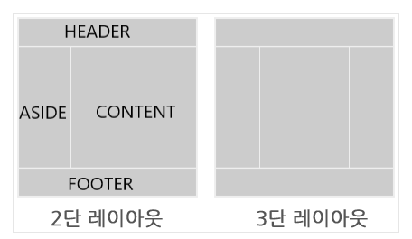

# 레이아웃 소개
레이아웃 제작은 모든 웹사이트를 만드는 과정에서 가장 먼저 선행되어 하는 작업

웹 페이지의 레이아웃이란?
- 레이아웃은 책이나 신문, 잡지 등의 출판물에서 글이나 그림을 효과적으로 정리하고 배치하는 일을 뜻하는 출판용어
- 이와같이 웹사이트를 제작할때 메뉴, 컨텐츠 부가정보 등과 같은 구성요소들을 필요한 곳에 위치하여 사용자가 효과적으로 웹사이트를 이용할 수 있게 배치하는 작업을 말함

레이아웃(그리드 레이아웃)의 종류
- 1단 레이아웃
- 다단(2, 3단....) 레이아웃
- 고정(상, 하단 고정) 레이아웃
- 그 외의 다양한 레이아웃

<br>

## 1단 레이아웃 제작

- 1단 레이아웃은 위의 이미지와 같이 하나의 행으로 이루어진 레이아웃의 형태를 말한다.
- 이런 형태의 레이아웃은 웹에서 가장 기본이 되는 레이아웃이며 위의 이미지 처럼 상단(header), 중단(contents), 하단(footer)의 구성으로 이루어져있는 것이 가장 일반적


1단 형태를 가진 사이트
- (네이버 쇼핑) shopping.naver.com/home/p/index.nhn 
- (네이버 사전) dict.naver.com  
- (네이버 포스트) post.naver.com/navigator.nhn  


작업 전 참고 사항
- 주요 기능 
  - 1개의 행(column)을 갖는 레이아웃
  - 요소로 header, content, footer를 가짐
- 스타일 정보
  - 컨텐츠 최대 가로 길이: 1200
  - 사이트 최소 가로 길이: 800
  - 컨텐츠 가운데 정렬
- 주요 태그 및 속성 
 - HTML
  - div
  - header
  - section
  - footer
- CSS
  - max-width
  - min-width
  - margin

```html
<!DOCTYPE html>
<html lang="ko">
  <head>
    <meta charset="utf-8">
    <title>1단 레이아웃</title>
    <style>
      .wrap {
        /* 최소 가로길이 */
        min-width: 800px;
        text-align: center;
      }
      .header {
        height: 100px;
        background-color: lightgreen;
      }
      .content {
        /* 최대 가로 길이 */
        max-width: 1200px;
        height: 300px;
        /* 블럭요소 가운데 정렬 */
        margin: 0 auto;
        background-color: lightsalmon;
      }
      .footer {
        height: 100px;
        background-color: lightblue;
      }
    </style>
  </head>
  <body>
    <div class="wrap">
      <div class="header">HEADER</div>
      <div class="content">CONTENT</div>
      <div class="footer">FOOTER</div>
    </div>
  </body>
</html>
```
- 레이아웃에 필요한 요소들(header, section, footer 등)을 `<body>`태그 안에 바로 작성하는 것 보다는 레이아웃과 관련된 아이템들을 감쌀 수 있는 wrap(또는 wrapper) 클래스를 가진 div를 만들어 레이아웃 컨테이너의 역할을 할 수 있도록 함
  - 권장을 하는것이지 무조건은 아님

<br>

## 다단 레이아웃 제작


위의 예시 이미지와 같이 콘텐츠의 영역이 2개 또는 그 이상의 행(column)으로 나눠진 레이아웃을 행의 갯수에 다라 2단, 3단 레이아웃으로 부르고 있으며 이런 행의 갯수에 따른 레이아웃들을 통들어서 다단 레이아웃이라고 부른다.

다단 레이아웃 형태를 가진 사이트
- 네이버 지식: https://kin.naver.com/index.nhn

작접 전 참고 사항
- 2단 레이아웃 가이드
- 주요 기능 
  - 콘텐츠의 행(column)이 두개를 갖는다.
  - 콘텐츠와 사이드영역의 구분선을 갖는다.
  - 구분선은 헤더와 푸터에 항상 맞닿는다. 
- 스타일 정보
  - 콘텐츠 영역 가로길이: 500px
  - 사이드 영역 가로길이: 300px
- 주요 태그 및 속성 
  - HTML
    - div
  - CSS
    - float
    - clear
    - display: table
    - display: table-cell

flex 이용
```html
<!DOCTYPE html>

<html lang="ko">
  <head>
    <meta charset="utf-8">
    <style>
      html, body, .wrap {
        height: 100%;
      }
      .header {
        height: 100px;
        background-color: lightgreen;
      }
      .container {
        position: relative;
        width: 800px;
        min-height: 100%;
        margin: -100px auto;
        padding: 100px 0;
        box-sizing: border-box;
      }
      .container::after {
        display: block;
        clear: both;
        content: '';
      }
      .content {
        float: left;
        width: 500px;
        height: 300px;
        background-color: lightsalmon;
      }
      .aside {
        float: right;
        width: 300px;
        height: 300px;
        background-color: lightseagreen;
      }
      .aside:after {
        position: absolute;
        top: 100px;
        bottom: 100px;
        right: 300px;
        width: 5px;
        background-color: #000;
        content: '';
      }
      .footer {
        height: 100px;
        background-color: lightblue;
      }
    </style>
  </head>
  <body>
    <div class="wrap">
      <div class="header">HEADER</div>
      <div class="container">
        <div class="content">CONTENT</div>
        <div class="aside">ASIDE</div>
      </div>
      <div class="footer">FOOTER</div>
    </div>
  </body>
</html>
```

table 이용
```html
<!DOCTYPE html>

<html lang="ko">
  <head>
    <meta charset="utf-8">
    <style>
      html, body, .wrap {
        height: 100%;
      }
      .header {
        height: 100px;
        background-color: lightblue;
      }
      .container {
        display: table;
        table-layout: fixed;
        width: 800px;
        min-height: 100%;
        margin: -100px auto;
        padding: 100px 0;
        box-sizing: border-box;
      }
      .content {
        display: table-cell;
        width: 500px;
        background-color: lightgreen;
        border-right: 5px solid #000;
      }
      .aside {
        display: table-cell;
        width: 300px;
        background-color: lightskyblue;
      }

      .footer {
        height: 100px;
        background-color: lightcoral;
      }
    </style>
  </head>
  <body>
    <div class="wrap">
      <div class="header">HEADER</div>
      <div class="container">
        <div class="content">CONTENT</div>
        <div class="aside">ASIDE</div>
      </div>
      <div class="footer">FOOTER</div>
    </div>
  </body>
</html>
```

## 고정 레이아웃 제작
고정 레이아웃이란 1단또는 2단 레이아웃의 형태에서 상단(header)과 하단(footer) 또는 그 두 영역이 모두 컨텐츠의 높이나 내용에 상관없이 항상 노출이 되도록 하는 레이아웃 형태입니다.

참고
- (네이버 소프트웨어야 놀자) https://www.playsw.or.kr/main
- (네이버 오디오클립) https://audioclip.naver.com
- (라인) https://line.me/ko

```
주요 기능 

header 영역과 footer 영역이 상하단에 고정노출
컨텐츠의 최소높이값이 100%인 레이아웃형태 만들기
스타일 정보

header 상단 고정
footer 하단 고정
콘텐츠 최소 높이값 100%
주요 태그 및 속성 

HTML
div
CSS
position: fixed
min-height
margin
padding
```


```
<!DOCTYPE html>

<html lang="ko">
  <head>
    <meta charset="utf-8">
    <style>
      
      html,
      body,
      .wrap {
         height: 100%;
      }
      .header {
          position: fixed;  
          top: 0; left: 0; right: 0; 
          height: 100px;
          background-color: lightgreen; 
      }
      .container {
          min-height: 100%; 
          margin-top: -100px; 
      }
      .content{
          height: 300px;
          padding-top: 200px; /* 가려진 height의 높이값과 끌어올린 footer의 높이값을 합친 값을 padding-top으로 밀어줍니다. */
          background-color: lightsalmon;
      }
      .footer{
          position: fixed; 
          bottom: 0; left: 0; right: 0;
          height:100px;
          background-color: lightblue;
      }
    </style>
  </head>
  <body>
    <div class="wrap">
      <div class="header">HEADER</div>
      <div class="container">
        <div class="content">CONTENT</div>
      </div>
      <div class="footer">FOOTER</div>
    </div>
  </body>
</html>
```