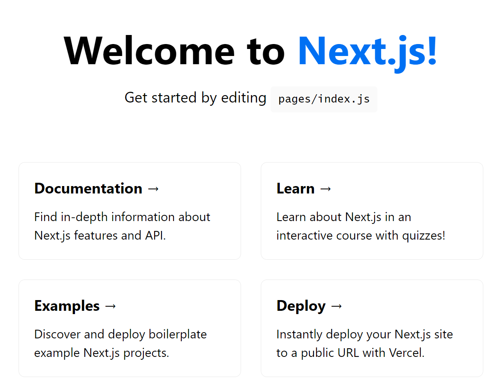

# NEXT JS
강사: 최지민

 

## 목차
- Next.js
- 웹 서비스를 만드는 방법
- 프론트엔드 개발자에게 도움이 될 꿀팁
- React에 대한 기초 지식을 다루지 않음

 

## 강의 진행 방식
- Next.js 기본 학습
- 간단한 토이 프로젝트 제작 실습
- Next.js 심화 학습
- 포토폴리오를 대비한 커머스 서비스 제작 실습
- 4 ~ 5 강의마다 Recap
- 큰 챕터가 끝날때마다 꿀팁 공유

 

## 강의에서 얻어 가야할 것?
- Next.js 에 대한 이해
- 포토폴리오를 만들 수 있는 실력과 자신감
- 더 나은 프론트엔드 개발자가 되기

 

## Next.js 소개 및 환경 설정
https://nextjs.org/
- The React Framework for Production.
- Next.js gives you the best developer experience with all the features you need for production: hybrid static & server rendering, TypeScript support, smart bundling, route pre-fetching, and more. No config needed.

### why Next.js
프론트엔드 개발자들이 가진 고민에 대한 적절한 해결책 제공
- 규모가 있는 서비스 구조 설계를 어떻게 할 것인가?
- 개발환경 / 코드 분할 / 파일 기반 구조
- SEO(검색 엔진 최적화)
- 프론트엔드에 필요한 간단한 API 구성
- 손쉬운 배포 시스템 Vercel

대체재로?
- Gatsby
- Remix

### 환경 설정

- install node (강의 기준 16.15.1)
- install yarn (강의 기준 1.22.19)
- install nextjs
  - `npx create-next-app nextjs-blog --use-npm --example "https://github.com/vercel/next-learn/tree/master/basics/learn-starter"`
- 폴더 이동 및 명령어 실행
  - `npm run dev` or `yarn run dev`
- 로컬 내 페이지 확인

### vscode extension
- react snippets
  - `rfc`
- eslint
- prettier
- bracket pair
  - 많은 사람들이 이용해 기본 기능으로 추가됨
  - vscode setting
    - ctrl + shift + p
    - setting.json
    - 다음의 내용 셋팅
      - `"editor.bracketPairColorization.enabled": true,`
      - `"editor.guides.bracketPairs":"active"`

 

## Next.js 로 만든 사례 둘러보기
wappalyzer 크롬 익스텐션
- https://www.wappalyzer.com/
- 웹페이지가 어떤 기술을 활용했는지 확인할 수 있는 도구

next js showcase
- https://nextjs.org/showcase

next js example
- https://nextjs.org/examples

