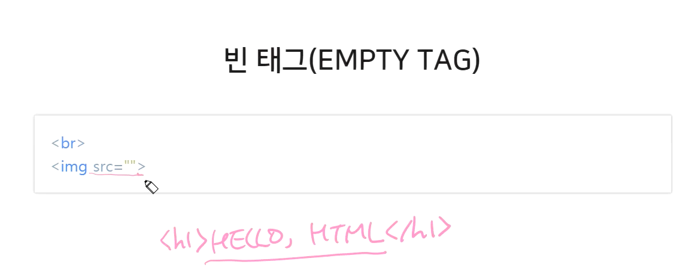
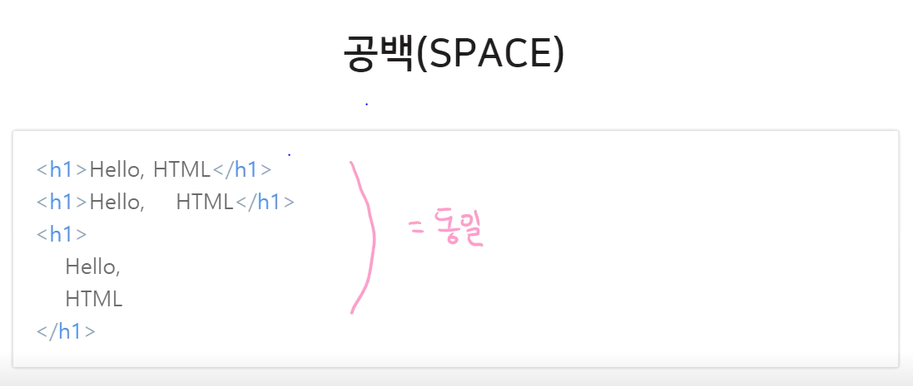

# HTML
- HTML(Hypertext Markup Language)은 웹을 이루는 가장 기초적인 구성 요소로, 웹 콘텐츠의 의미와 구조를 정의할 때 사용
  - Hypertext란 웹페이지를 다른 페이지로 연결하는 링크를 말함
  - HTML은 웹 브라우저에 표시되는 글과 이미지 등의 다양한 콘텐츠를 표시하기 위해 마크업을 사용

<br>

## HTML 문법

### 태그

- HTML은 태그들의 집합이며, HTML에서 가장 중요하고 기본이 되는 규칙
- 태그는 '무언가를 표시하기 위한 꼬리표, 이름표'라는 의미가 있으며, HTML에서도 이와 비슷한 의미로 해석
- 요소?
  - 내용을 포함한 태그 전체를 요소(Element)
  - HTML 요소는 "태그"를 사용해서 문서의 다른 텍스트와 구분
    
### 속성

- 태그에 추가로 정보를 제공하거나 태그의 동작이나 표현을 제어할 수 있는 설정값을 의미
- 속성은 이름과 값으로 이루어짐
- `이름="속성값"`으로 표현
- 의미와 용도에 따라 여러 속성이 존재하며 하나의 태그에 여러 속성을 선언할 수 있다.
- 속성은 종류에 따라 모든 태그에 사용할 수 있는 글로벌 속성과 태그에서만 사용할 수 있는 속성으로 구분

### 태그의 중첩

- 태그 안에 다른 태그를 선언할 수 있다.
- 태그를 중첩해서 사용 시 중첩되는 태그는 부모 태그를 벗어나서는 안됨

### 빈 태그

- 종료 태그가 없는 태그
- 빈 태그는 내용만 비어있을 뿐 속성을 통해서 화면에 나타내거나 화면에 표시되지 않더라도 다른 용도로 사용되는 태그
- Ex) img, br, input


### 공백

- 기본적으로 HTML은 두 칸 이상의 공백을 모두 무시
- 두칸 이상의 공백과 개행을 모두 무시하기 떄문의 위의 이미지 결과는 모두 같은 텍스트가 화면에 나타나게 된다.

### 주석
- `<!-- -->`
- comment tags
- 주석은 화면에 노출되지 않고 메모의 목적으로만 사용하는 것을 의미
- HTML 파일 내에 주석으로 표시를 해주면 브라우저는 해당 부분을 인식하여 해석하지 않는다.

## 문서의 기본 구조
```html
<!DOCTYPE html>
<html lang="ko">
  <head>
    <meta charset="utf-8">
    <title>HTML</title>
  </head>
  <body>
    <h1>HELLO, HTML</h1>
  </body>
</html>
```
- HTML의 기본 구조는 웹 문서를 작성할 때 반드시 들어가야 하는 기본적인 내용이므로 크게 문서 타입 정의와 `<html>` 요소로 구분한다.
- `<!DOCTYPE html>`
  - 문서 타입 정의는 보통 DTD(doctype)라고 부른다.
  - 이 문서가 어떤 버전으로 작성되었는지 브라우저에 알려주는 선언문이며 반드시 문서 최상단에 선언되어야 한다.
- `<html></html>`
  - html 태그의 lang 속성은 문서가 어느 언어로 작성되었는지를 의미
  - head 태그에 위치하는 태그들은 브라우저의 화면에 표시되지 않는다. 대신 문서의 기본 정보 설정이나 외부 스타일 시트 파일 및 js 파일을 연결하는 등의 역할을 한다.
  - meta 태그의 charset 속성은 문자의 인코딩 방식을 지정
  - body 태그에는 실제 브라우저 화면에 나타내는 내용이 들어가며, 앞으로 우리가 다루는 태그들 대부분이 모두 여기에 해당된다.

## 제목과 단락요소
```html
<h1>Hello world!!</h1>

<p>...... <br> </p>
```
제목 태그(heading)
- 문서 내에 제목을 표현할 때 사용하는 태그
- 태그 이름은 heading을 줄여서 `h`로 쓰며, 제목의 레벨에 따라서 `<h1> ~ <h6>`까지 있다.
- 숫자가 올라갈수록 조금 더 낮은 수준의 소제목을 나타내게 됨

단락 태그(paragraph)
- 단락 태그는 paragraph를 줄여서 `p`로 쓴다.

개행
- `<br>`

## 택스트를 꾸며주는 요소
```html
<p>
  <b>Lorem</b> <i>ipsum</i> dolor sit amet<br>
  <u>Lorem</u> <s>ipsum</s> dolor sit amet
</p>
```

웹 표쥰화가 대두되면서 웹 문서의 구조와 표현을 분리
- `<b>` : bold 태그는 글자를 굵게 표현하는 태그
- `<i>` : italic 태그는 글자를 기울여서 표현하는 태그
- `<u>` : underline 태그는 글자의 밑줄을 표현하는 태그
- `<s>` : strike 태그는 글자의 중간선을 표현하는 태그

## 앵커 요소
```html
<a href="https://www.naver.com/" target="_blank">Naver</a>
```
- a태그, 앵커, 링크 등 여러 이름으로 불린다.
- href 속성
  - 링크를 만들기 위해 a태그는 반드시 href(hypertext reference)속성을 가지고 있어야 한다.
  - href속성의 값은 링크의 목적지가 되는 URL 이다.
- target 속성
  - target 속성은 링크된 리소스를 어디에 표시할지를 나타내는 속성
  - _self, _blank, _parent, _top이 있다.
    - _self는 현재 화면에 표시한다.(default)
    - _blank는 새로운 창에 표시한다는 의미로 외부 페이지가 나타나게끔 하는 속성
    - _parent와 _top은 프레임이라는 특정 조건에서만 동작하는 속성

## 의미가 없는 컨테이너 요소
```html
<div>
  <span>Lorem</span>ipsum dolor sit.
</div>
```
의미가 없는  컨테이너 요소
- 태그 자체에 아무 의미가 없으며, 단순히 요소들을 묶기위해 사용되는 태그
- 스타일을 주거나 서버에 보내는 데이터를 담기 위한 용도로 이런 의미 없는 요소들이 사용됨
  
div 태그와 span 태그
- div(division) 태그는 블록 레벨 태그
- 블록 레벨 요소는 기본적으로 한 줄을 생성해서 내용을 표현
- span 태그는 인라인 레벨 태그
- 인라인 레벨 요소들은 블록 레벨 요소의 한 줄 안에서 표현되는 여러 요소들

## 리스트 요소
리스트는 일련된 항목들이 나열된 것들을 의미

ul 태그
```html
<ul>
  <li>1</li>
  <li>2</li>
  <li>3</li>
</ul>
```
- ul(unordered list) 태그는 순서가 없는 리스트를 표현할 때 사용


ol 태그
```html
<ol>
  <li>1</li>
  <li>2</li>
  <li>3</li>
</ol>
```
- ol(ordered list) 태그는 순서가 있는 리스트를 표현할 때 사용

dl 태그
```html
<dl>
  <dt>TITLE_1</dt>
  <dd>info1</dd>
  <dd>info2</dd>
  <dt>TITLE_2</dt>
  <dd>info1</dd>
</dl>
```
- dl(definition/description list) 태그는 용어와 그에 대한 정의를 표현할 떄 사용
- dl은 용어와 설명이 하나의 세트로 항목을 이루고 하나 이상의 항목으로 리스트가 이루어지는 구조
  - `<dt>`: 용어를 나타내는 태그
  - `<dd>`: 용어에 대한 정의 또는 설명을 나타내는 태그

## 이미지 요소


- width, height
  - 값의 단위는 필요하지 않음
  - 값을 입력하면 자동으로 픽셀 단위로 계산
  - 선택적인 속성이지만, 이미지의 크기가 고정적이라면 해당 속성을 선언하는게 성능적인 측에서 좋다.
  - 속성이 없는 경우 이미지는 원본 크기 그대로 노출
  - 둘 중 하나만 선언하면 나머지 한 속성은 선언한 속성의 크기에 맞춰 자동으로 비율에 맞게 변경

이미지 파일 형식
- gif : 제한적인 색을 사용하고 용량이 적으며 투명 이미지와 애니메이션 이미지를 지원하는 형식
- jpg : 사진이나 일반적인 그림에 쓰이며 높은 압축률과 자연스러운 색상 표현을 지원하는 형식(투명을 지원하지 않는다.)
- png : 이미지 손실이 적으며 투명과 반투명을 모두 지원하는 형식