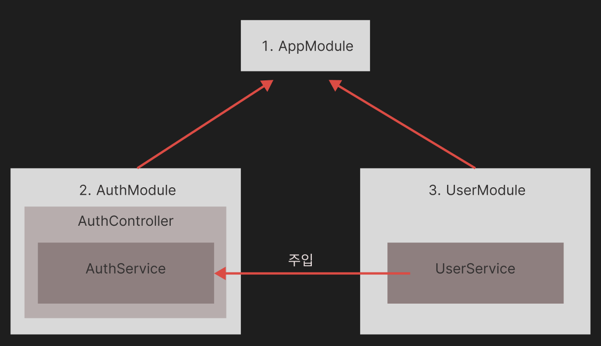

# CHAPTER10 회원 가입과 인증하기

학습 목표?

- 인증(Authentication)은 누구인지를 확인하는 절차이고, 인가(Authorization)는 인증된 사용자의 권한을 확인하는 절차
- 인증과 인가는 비슷한 단어이지만 의미가 다르므로 구분해서 사용해야 한다.
- 10장에서는 쿠키와 세션을 사용해 인증 기능을 구현

## 10.1 실습용 프로젝트 설정

1. nest-cli 로 프로젝트 생성하기
2. user 모듈 생성하기
3. SQLite 데이터베이스 설정하기

### 10.1.1 nest-cli 로 프로젝트 생성

```
nest new nest-auth-test
```

구조


- AppModule 에는 전체 애플리케이션 관련 설정을
- AuthModule 에는 인증 관련 기능
  - AuthController 에는 인증에 필요한 핸들러 메서드를 설정
  - AuthService 의 회원 가입 메서드에는 UserService 를 주입하여 사용
- UserModule 모듈에는 유저 데이터를 다루는 기능
  - UserService 에는 회원정보 추가, 수정, 삭제 등의 메서드가 있음

### 10.1.2 User 모뮬 생성하기

```
nest g module user
nest g controller user --no-spec
nest g service user --no-spec
```

```
src
  /app.controller.spec.ts
  /app.controller.ts
  /app.module.ts
  /app.service.ts
  /main.ts
  /user
    /user.controller.ts
    /user.module.ts
    /user.service.ts
```

### 10.1.3 SQLite 데이터베이스 설정하기

```
npm install sqlite3
npm install typeorm
npm install @nestjs/typeorm
```

app.module.ts 내 설정

```ts
import { Module } from "@nestjs/common";
import { AppController } from "./app.controller";
import { AppService } from "./app.service";
import { UserModule } from "./user/user.module";
import { TypeOrmModule } from "@nestjs/typeorm";

@Module({
  imports: [
    UserModule,
    TypeOrmModule.forRoot({
      // 데이터베이스의 타입
      type: "sqlite",
      // 데이터베이스 파일명
      database: "nest-auth-test.sqlite",
      // 엔티티 리스트
      entities: [],
      // 데이터베이스에 스키마를 동기화
      synchronize: true,
      // SQL 실행 로그 확인
      logging: true,
    }),
  ],
  controllers: [AppController],
  providers: [AppService],
})
export class AppModule {}
```

- `type`, `database`, `entities` 만 설정해주면 동작함
- `entities`에는 엔티티로 만드는 객체를 넣어줌
- `synchronize` 를 true 로 하면 서버 기동 시 서버가 엔티티 객체를 읽어 데이터베이스 스키마를 만들거나 변경해줌
  - 해당 옵션은 개발용으로만 사용해야함
- logging 은 true 로 설정 시 SQL 실행 로그를 확인 할 수 있음
  - 개발 시에 유용하니 true 로 해주면 좋음

## 10.2 유저 모듈의 엔티티, 서비스, 컨트롤러 생성하기

엔티티 -> 서비스 -> 컨트롤러 순으로 만들어본다.

### 10.2.1 엔티티 만들기

유저 엔티티는 데이터베이스 테이블과 1:1로 매칭되는 객체이다.

```ts
/**
 * /src/user/user.entity.ts
 */

// 데코레이터 임포트
import { Column, Entity, PrimaryGeneratedColumn } from "typeorm";

// 엔티티 객체임을 알려주기 위한 데코레이터
@Entity()
export class User {
  @PrimaryGeneratedColumn()
  // id는 pk이며 자동 증가하는 값
  id?: number;

  @Column({ unique: true })
  // email은 유니크한 값
  email: string;

  @Column()
  password: string;

  @Column()
  username: string;

  @Column({
    type: "datetime",
    default: () => "CURRENT_TIMESTAMP",
  })
  // 기본값을 넣어줌
  createdDt: Date = new Date();
}
```

- 엔티티 객체는 `@Entity` 데코레이터를 붙여줘야 다른 곳에 의존성 주입을 할 수 있다.
- `@PrimaryGeneratedColumn`이 붙은 필드는 기본키이면서 자동 증가하는 컬럼이 됨
  - 자동 증가하는 값이므로 데이터 생성 시에는 필요하지 않기 때문
- `@Column`이 붙으면 데이터베이스의 컬럼으로 인식
  - `unique:true`를 붙여주면 중복 데이터가 존재하는 경우 저장되지 않고 에러가 남
  - 생성일 데이터는 기본값을 넣도록 `default: true` 설정을 추가함

```ts
import { Injectable } from "@nestjs/common";
import { InjectRepository } from "@nestjs/typeorm";
import { User } from "./user.entity";
import { Repository } from "typeorm";

@Injectable()
export class UserService {
  // 리포지토리 주입
  constructor(
    @InjectRepository(User) private userRepository: Repository<User>
  ) {}
}
```

### 10.2.2 컨트롤러 만들기

유저 컨트롤러는 유저가 요청을 보냈을 때 실행되는 핸들러 메서드를 정의한다.

- 유저 추가
- 로그인에 사용할 1명의 유저 찾기
- 정보 업데이터
- 삭제

유저가 HTTP 요청을 보내면 아래의 순서로 호출

1. UserController
2. UserService
3. UserRepository

```ts
import {
  Body,
  Controller,
  Delete,
  Get,
  Param,
  Post,
  Put,
} from "@nestjs/common";
import { UserService } from "./user.service";
import { User } from "./user.entity";

@Controller("user")
export class UserController {
  // user service 주입
  constructor(private userService: UserService) {}

  @Post("/create")
  createUser(@Body() user: User) {
    return this.userService.createUser(user);
  }

  @Get("/getUser/:email")
  async getUser(@Param("email") email: string) {
    const user = await this.userService.getUser(email);
    console.log(user);
    return user;
  }

  @Put("/update/:email")
  updateUser(@Param("email") email: string, @Body() user: User) {
    console.log(user);
    return this.userService.updateUser(email, user);
  }

  @Delete("/delete/:email")
  deleteUser(@Param("email") email: string) {
    return this.userService.deleteUser(email);
  }
}
```

### 10.2.3 서비스 만들기

서비스는 컨트롤러와 리포지토리를 이어주는 역할을 하며, 아래의 클래스를 작성해 보자

- 유저 데이터의 생성
- 특정 유저 정보 가져오기
- 수정
- 삭제

```ts
/**
 * user.service.ts
 */
import { Injectable } from "@nestjs/common";
import { InjectRepository } from "@nestjs/typeorm";
import { User } from "./user.entity";
import { Repository } from "typeorm";

// 의존성 주입을 위한 데코레이터
@Injectable()
export class UserService {
  // 리포지토리 주입
  constructor(
    @InjectRepository(User) private userRepository: Repository<User>
  ) {}

  // 유저 생성
  createUser(user): Promise<User> {
    return this.userRepository.save(user);
  }

  // 한 명의 유저 정보 찾기
  async getUser(email: string) {
    const result = await this.userRepository.findOne({
      where: { email },
    });
    return result;
  }

  // 유저 정보 업데이트, username과 password 만 변경
  async updateUser(email, _user) {
    const user: User = await this.getUser(email);
    console.log(_user);

    user.username = _user.username;
    user.password = _user.password;
    console.log(user);

    this.userRepository.save(user);
  }

  // 유저 정보 삭제
  deleteUser(email: string) {
    return this.userRepository.delete({ email });
  }
}
```

```ts
/**
 * user.module.ts
 */
import { Module } from "@nestjs/common";
import { UserController } from "./user.controller";
import { UserService } from "./user.service";
import { TypeOrmModule } from "@nestjs/typeorm";
import { User } from "./user.entity";

@Module({
  imports: [TypeOrmModule.forFeature([User])],
  controllers: [UserController],
  providers: [UserService],
})
export class UserModule {}

/**
 * app.module.ts
 */
import { Module } from "@nestjs/common";
import { AppController } from "./app.controller";
import { AppService } from "./app.service";
import { UserModule } from "./user/user.module";
import { TypeOrmModule } from "@nestjs/typeorm";
import { User } from "./user/user.entity";

@Module({
  imports: [
    UserModule,
    TypeOrmModule.forRoot({
      // 데이터베이스의 타입
      type: "sqlite",
      // 데이터베이스 파일명
      database: "nest-auth-test.sqlite",
      // 엔티티 리스트
      entities: [User],
      // 데이터베이스에 스키마를 동기화
      synchronize: true,
      // SQL 실행 로그 확인
      logging: true,
    }),
  ],
  controllers: [AppController],
  providers: [AppService],
})
export class AppModule {}
```

```
### 유저 생성
POST http://localhost:3000/user/create
Content-Type: application/json

{
  "email": "andy@test.com",
  "username": "andy",
  "password": "test1234"
}

### 유저 정보 찾기
GET http://localhost:3000/user/getUser/andy@test.com


### 유저 정보 업데이트 하기
PUT  http://localhost:3000/user/update/andy@test.com
Content-Type: application/json

{
  "email": "andy@test.com",
  "username": "andy2",
  "password": "test1234"
}

### 유저 삭제
DELETE http://localhost:3000/user/delete/andy@test.com
```

## 10.3 파이프로 유효성 검증하기

NestJS에서는 파이프를 사용해서 유효성을 검증

### 10.3.1 전역 ValidationPipe 설정하기

main.ts에 설정

1. 의존성 설치
2. 임포트
3. 전역 파이프 설정에 ValidationPipe 객체를 생성 및 추가

```
// 의존성 설치
npm install class-validator class-transformer
```

```ts
import { ValidationPipe } from "@nestjs/common";
import { NestFactory } from "@nestjs/core";
import { AppModule } from "./app.module";

async function bootstrap() {
  const app = await NestFactory.create(AppModule);
  app.useGlobalPipes(new ValidationPipe());
  await app.listen(3000);
}
bootstrap();
```

### 10.3.2 UserDto 만들기

생성 시와 수정 시 검사 항목이 다르기 때문에 CreateDto와 UpdateUserDto를 따로 만든다.

```ts
import { IsEmail, IsString } from "class-validator";

// email, password, username 필드를 만들고 데코레이터 붙이기
export class CreateUserDto {
  @IsEmail()
  email: string;

  @IsString()
  password: string;

  @IsString()
  username: string;
}

// 업데이트의 유효성 검증 시 사용할 DTO
export class UpdateUserDto {
  @IsString()
  username: string;

  @IsString()
  password: string;
}
```

### 10.3.3 테스트하기

```
### 잘못된 이메일을 입력한 경우
POST http://localhost:3000/user/create
Content-Type: application/json

{
  "email": "andy",
  "username": "andy",
  "password": "test1234"
}
```

## 10.4 인증 모듈 생성 및 회원 가입하기

인증은 정확성과 시간 측면에서 사용자의 자격증명을 확안히는 것

- 정확성 측면에서는 사용자의 자격증명을 기존 정보를 기반으로 확인 후 인증 토큰을 발급하는 것을 말함
- 시간 측면에는 사용자에게 부여된 인증 토큰은 특정 기간 동안만 유효하다는 것을 말함

인증을 만드는 방법은 2가지가 있음

- 쿠키, 토큰

### 쿠키

장점

- 하위 도메인에서도 같은 세션을 사용할 수 있음
- 저장 공간을 적게 차지함
- 브라우저에서 관리함
- httpOnly 설정을 하면 클라이언트에서 자바스크립트로 조작할 수 없음

단점

- 사이트 간 위조 공격(CSRF)이 있을 수 있음
- 서버에 저장해야 하므로 스케일링 이슈가 있음
- API 인증으로는 좋지 않음

저장소

- 브라우저에서 관리

### 토큰

장점

- 유연하며 사용이 간단함
- 크로스 플랫폼 대용
- 다양한 프론트엔드 애플리케이션에서 대응

단점

- 토큰 노출 시 권한 삭제가 어려움
- 거부 목록을 따로 관리해야 하는데 그러면 무상태가 아니게됨
- 쿠키보다 공간을 많이 사용함
- JWT 내부 정보는 토큰 생성 시의 데이터이브로 최신 데이터를 반영하지 않을 수 있음

저장소

- 커스텀 HTTP 헤더 사용(주로 Authorization)

### 10.4.1 인증 모듈 만들 및 설정하기

```
nest g module auth
nest g service auth --no-spec
nest g service auth --no-spec
```

인증 모듈의 AuthService 에서는 회원 가입이나 로그인/로그아웃 처리에 UserService를 이용

- `@Injectable()` 이 붙어 있는 프로바이더의 경우 같은 모듈의 다른 클래스에서 주입해 사용할 수 있음
- 다만 다른 모듈에서 사용하려면 `@Module` 데코레이터의 속성으로 exports 에 프로바이더를 넣어주어야 함

```ts
import { Module } from "@nestjs/common";
import { AuthService } from "./auth.service";
import { AuthController } from "./auth.controller";
import { UserModule } from "src/user/user.module";

@Module({
  imports: [UserModule],
  providers: [AuthService],
  controllers: [AuthController],
})
export class AuthModule {}
```

### 10.4.2 회원 가입 메서드 만들기

비밀번호 같은 민감한 정보는 무조건 암호화해야 한다.

```
npm install bcrypt
npm install -D @types/bcrypt
```

```ts
import { HttpException, HttpStatus, Injectable } from "@nestjs/common";
import { CreateUserDto } from "src/user/user.dto";
import { UserService } from "src/user/user.service";
import * as bcrypt from "bcrypt";

@Injectable()
export class AuthService {
  constructor(private userService: UserService) {}

  async register(userDto: CreateUserDto) {
    const user = await this.userService.getUser(userDto.email);

    if (user) {
      throw new HttpException(
        "해당 유저가 이미 있습니다.",
        HttpStatus.BAD_REQUEST
      );
    }

    const encryptedPassword = bcrypt.hashSync(userDto.password, 10);

    try {
      const user = await this.userService.createUser({
        ...userDto,
        password: encryptedPassword,
      });
      user.password = undefined;
      return user;
    } catch (error) {
      throw new HttpException("서버 에러", 500);
    }
  }
}
```

```ts
import { Body, Controller, Post } from "@nestjs/common";
import { AuthService } from "./auth.service";
import { CreateUserDto } from "src/user/user.dto";

@Controller("auth")
export class AuthController {
  constructor(private authService: AuthService) {}

  @Post("register")
  async register(@Body() userDto: CreateUserDto) {
    return await this.authService.register(userDto);
  }
}
```

### 10.4.3 SQLite 익스텐션으로 테이블 확인하기

## 10.5 쿠키를 사용한 인증 구현하기

NestJS에서 인증을 구현할 때는 보통 인증용 미들웨어인 가드를 함께 사용한다.

- 가드는 특정 상황(권한, 룰, 엑세스컨트롤)에서 받은 요청을 가드를 추가한 라우트 메서드에서 처리할지 말지를 결정하는 역할

### 10.5.1 AuthService 에 이메일과 패스워드 검증 로직 만들기

```ts
import { Body, Controller, Post, Request, Response } from "@nestjs/common";
import { AuthService } from "./auth.service";
import { CreateUserDto } from "src/user/user.dto";

@Controller("auth")
export class AuthController {
  constructor(private authService: AuthService) {}

  @Post("register")
  async register(@Body() userDto: CreateUserDto) {
    return await this.authService.register(userDto);
  }

  @Post("login")
  async login(@Request() req, @Response() res) {
    const userInfo = await this.authService.validateUser(
      req.body.email,
      req.body.password
    );

    if (userInfo) {
      res.cookie("login", JSON.stringify(userInfo), {
        httpOnly: false,
        maxAge: 1000 * 60 * 60 * 24 * 7,
      });
    }
    return res.send({ message: "login success" });
  }
}
```

```
### 로그인
POST http://localhost:3000/auth/login
Content-Type: application/json

{
  "email": "andy@test.com",
  "password": "test1234"
}
```

### 10.5.2 가드를 사용해 인증됐는지 검증하기

NestJS 에는 인증할 때 가드라는 미들웨어를 보편적으로 사용

- 가드는 `@Injectable()` 데코레이터가 붙어 있고 `CanActivate` 인터페이스를 구현한 클래스
- `UseGuard` 데코레이터로 가드를 사용할 수 있다.
  - `@Get`, `@Post` 등이 붙어 있는 핸들러 메서드에 넘기기 전에 인증 관련된 처리를 할 수 있다.

우리는 다음과 같은 구조를 만들것이다.

- 클라이언트에서 요청
- 가드 `canActive()`를 통하여 인증 확인
  - true: 핸들러 함수 호출 및 검증 성공시 응답값 반환
  - false: 검증 실패, 403 에러 반환

```
npm install cookie-parser
```

주의할 점으로 가드 내에서 응답에 쿠키를 설정할 수 없다.

또한 가드는 모든 미들웨어의 실행이 끝난 다음에 실행되며 filter나 pipe 보다는 먼저 실행됨

## 10.6 패스트포트와 세션을 사용한 인증 구현하기

쿠키만으로 인증하면 위변조와 탈취의 위험에서 자유롭지 못한다

보안을 더 강화하기 위하여 서버에서 인증을 하고 해당 정보를 서버의 특정 공간에 저장해 두는 것

이대 사용 하는것이 세션.

- 세션을 사용할 때도 쿠키를 사용
- 쿠키는 세션을 찾는 정보만 저장하고 중요 정보는 세션에 모두 넣는 것
- 세션은 서버의 자원을 사용하는 것이므로 서버에 부하를 주는 단점이 있지만, 위조, 변조, 탈취가 불가능하므로 보안적으로는 더 안전하다고 할 수 있음

가드, 패스포트의 스트래티지, 세션 시리얼라이저가 서로 협력해서 사용자 신원을 확인하고, 인증 정보를 저장하고 읽어와서 다시 인증하는 작업을 한다.

```
1. http 요청
2. 가드 - http 요청을 핸들러에 넘기기 전확인
3. 스트래티디 - 사용자 인증 확인
4. 세션 시리얼라이져 - 세션에서 정보 읽기
```

### 10.6.1 라이브러리 설치 및 설정하기

```
npm i @nestjs/passport passport passport-local express-session
npm i -D @types/passport-local @types/express-session
```

```ts
import { ValidationPipe } from "@nestjs/common";
import { NestFactory } from "@nestjs/core";
import { AppModule } from "./app.module";
import * as cookieParser from "cookie-parser";
import * as passport from "passport";
import * as session from "express-session";

async function bootstrap() {
  const app = await NestFactory.create(AppModule);
  app.useGlobalPipes(new ValidationPipe());
  // 쿠키 파서 설정
  app.use(cookieParser());
  app.use(
    session({
      // 세션 암호화에 사용되는 키 - 절대 유출 금지
      secret: "very-important-secret",
      // 세션을 항상 저장할지 여부
      // - http 요청일 올때 마다 세션을 저장하면 효율이 떨어질 수 있음
      resave: false,
      // 세션이 저장되기 전에는 초기화 되지 않은 상태로 세션을 미리 만들어 저장
      // - 인증이 되지 않은 사용자 정보도 빈 값으로 저장하므로 false를 설정하여 불필요한 공간 차지 않게
      saveUninitialized: false,
      cookie: { maxAge: 3600000 },
    })
  );
  app.use(passport.initialize());
  app.use(passport.session());
  await app.listen(3000);
}
bootstrap();
```

### 10.6.2 로그인과 인증에 사용할 가드 구현하기

```ts
import { CanActivate, ExecutionContext, Injectable } from "@nestjs/common";
import { AuthService } from "./auth.service";
import { AuthGuard } from "@nestjs/passport";

@Injectable()
export class LoginGuard implements CanActivate {
  constructor(private authService: AuthService) {}

  async canActivate(context: any): Promise<boolean> {
    const request = context.switchToHttp().getRequest();

    if (request.cookies["login"]) {
      return true;
    }

    if (!request.body.email || !request.body.password) {
      return false;
    }

    const user = await this.authService.validateUser(
      request.body.email,
      request.body.password
    );

    if (!user) {
      return false;
    }

    request.user = user;
    return true;
  }
}

@Injectable()
export class LocalAuthGuard extends AuthGuard("local") {
  async canActivate(context: any): Promise<boolean> {
    const result = (await super.canActivate(context)) as boolean;
    // 로컬 스트래티지 실행
    const request = context.switchToHttp().getRequest();
    // 세션 저장
    await super.logIn(request);
    return result;
  }
}

@Injectable()
export class AuthenticatedGuard implements CanActivate {
  canActivate(context: ExecutionContext): boolean {
    const request = context.switchToHttp().getRequest();
    // 세션에서 정보를 읽어서 인증 확인
    return request.isAuthenticated();
  }
}
```

### 10.6.3 세션에 정보를 저장하고 읽는 세션 시리얼라이저 구현하기

```ts
import { Injectable } from "@nestjs/common";
import { PassportSerializer } from "@nestjs/passport";
import { UserService } from "src/user/user.service";

@Injectable()
export class SessionSerializer extends PassportSerializer {
  constructor(private userService: UserService) {
    super();
  }
  // 세션에 정보를 저장할 때 사용
  serializeUser(user: any, done: (err: Error, user: any) => void): any {
    done(null, user.email);
  }
  // 세션에서 정보를 꺼내올 때 사용
  async deserializeUser(
    payload: any,
    done: (err: Error, user: any) => void
  ): Promise<any> {
    const user = await this.userService.getUser(payload);

    if (!user) {
      done(new Error("No User"), null);
      return;
    }
    const { password, ...userInfo } = user;
    done(null, userInfo);
  }
}
```
